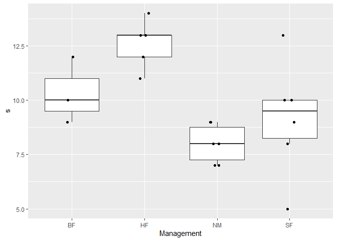
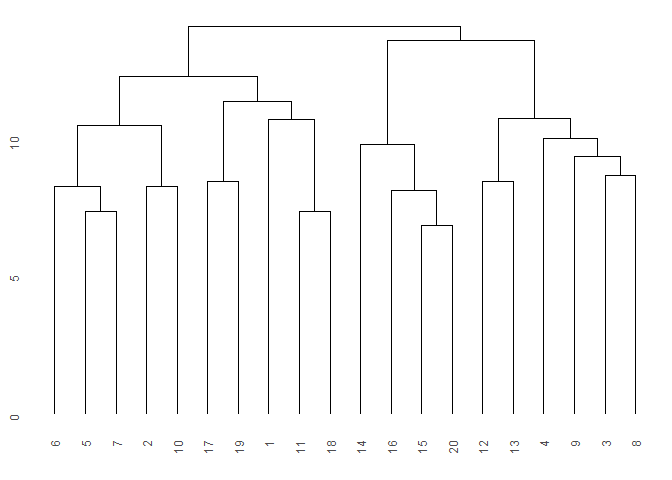
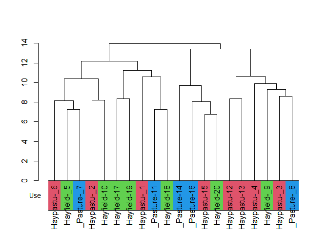
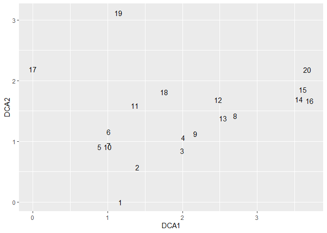
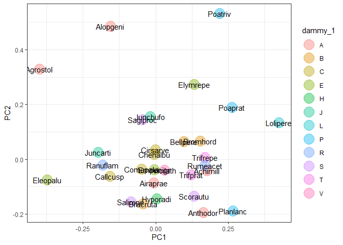

# ecan

The goal of ecan is to support ecological analysis.

## Installation

``` r
install.packages("ecan")
  # development
  # install.packages("devtools")
remotes::install_github("matutosi/ecan")
```

You can use almost the same functionality in shiny.

<https://matutosi.shinyapps.io/ecanvis/> .

## Example

You can read docs in <https://matutosi.github.io/ecan/>

### Prepare and convert data

``` r
library(ecan)
library(vegan)
#> Loading required package: permute
#> Loading required package: lattice
#> This is vegan 2.6-6.1
library(dplyr)
library(stringr)
library(tibble)
library(ggplot2)
data(dune)
data(dune.env)

df <- 
  table2df(dune) %>%
  dplyr::left_join(tibble::rownames_to_column(dune.env, "stand"))
#> Joining with `by = join_by(stand)`

sp_dammy <- 
 tibble::tibble("species" = colnames(dune), 
                "dammy_1" = stringr::str_sub(colnames(dune), 1, 1),
                "dammy_6" = stringr::str_sub(colnames(dune), 6, 6))

df <- 
  df %>%
  dplyr::left_join(sp_dammy)
#> Joining with `by = join_by(species)`

df
#> # A tibble: 197 × 10
#>    stand species  abundance    A1 Moisture Management Use      Manure dammy_1
#>    <chr> <chr>        <dbl> <dbl> <ord>    <fct>      <ord>    <ord>  <chr>  
#>  1 1     Achimill         1   2.8 1        SF         Haypastu 4      A      
#>  2 1     Elymrepe         4   2.8 1        SF         Haypastu 4      E      
#>  3 1     Lolipere         7   2.8 1        SF         Haypastu 4      L      
#>  4 1     Poaprat          4   2.8 1        SF         Haypastu 4      P      
#>  5 1     Poatriv          2   2.8 1        SF         Haypastu 4      P      
#>  6 2     Achimill         3   3.5 1        BF         Haypastu 2      A      
#>  7 2     Alopgeni         2   3.5 1        BF         Haypastu 2      A      
#>  8 2     Bellpere         3   3.5 1        BF         Haypastu 2      B      
#>  9 2     Bromhord         4   3.5 1        BF         Haypastu 2      B      
#> 10 2     Elymrepe         4   3.5 1        BF         Haypastu 2      E      
#> # ℹ 187 more rows
#> # ℹ 1 more variable: dammy_6 <chr>
```

### Diversity index

``` r
div <- 
  shdi(df) %>%
  dplyr::left_join(select_one2multi(df, "stand"))
#> Joining with `by = join_by(stand)`

group <- "Management"
div_index <- "s"
div %>%
  ggplot(aes(x = .data[[group]], y = .data[[div_index]])) + 
    geom_boxplot(outlier.shape = NA) +  # do not show outer point
    geom_jitter(height = 0, width = 0.1)
```



### Indicator Species Analysis (ISA, ind val)

``` r
ind_val(df, group = "Moisture", row_data = TRUE)
#> $relfrq
#>                  1    2         3   4
#> Achimill 0.7142857 0.50 0.0000000 0.0
#> Elymrepe 0.4285714 0.50 0.0000000 0.5
#> Lolipere 1.0000000 0.75 0.1428571 0.5
#> Poaprat  1.0000000 1.00 0.2857143 0.5
#> Poatriv  0.7142857 0.75 0.4285714 1.0
#> Alopgeni 0.1428571 0.50 0.4285714 1.0
#> Bellpere 0.4285714 0.75 0.0000000 0.0
#> Bromhord 0.4285714 0.50 0.0000000 0.0
#> Scorautu 0.8571429 1.00 0.8571429 1.0
#> Trifrepe 0.8571429 0.75 0.7142857 1.0
#> Agrostol 0.0000000 0.50 0.8571429 1.0
#> Bracruta 0.7142857 0.75 0.7142857 1.0
#> Cirsarve 0.0000000 0.25 0.0000000 0.0
#> Sagiproc 0.1428571 0.25 0.4285714 1.0
#> Anthodor 0.4285714 0.50 0.1428571 0.0
#> Planlanc 0.7142857 0.50 0.0000000 0.0
#> Rumeacet 0.4285714 0.00 0.0000000 1.0
#> Trifprat 0.4285714 0.00 0.0000000 0.0
#> Juncbufo 0.1428571 0.00 0.1428571 1.0
#> Eleopalu 0.0000000 0.00 0.7142857 0.0
#> Juncarti 0.0000000 0.00 0.5714286 0.5
#> Ranuflam 0.0000000 0.00 0.8571429 0.0
#> Vicilath 0.2857143 0.25 0.0000000 0.0
#> Hyporadi 0.1428571 0.25 0.1428571 0.0
#> Chenalbu 0.0000000 0.00 0.1428571 0.0
#> Comapalu 0.0000000 0.00 0.2857143 0.0
#> Callcusp 0.0000000 0.00 0.4285714 0.0
#> Airaprae 0.0000000 0.25 0.1428571 0.0
#> Salirepe 0.1428571 0.00 0.2857143 0.0
#> Empenigr 0.0000000 0.00 0.1428571 0.0
#> 
#> $relabu
#>                   1         2          3          4
#> Achimill 0.48780488 0.5121951 0.00000000 0.00000000
#> Elymrepe 0.25531915 0.2978723 0.00000000 0.44680851
#> Lolipere 0.46204620 0.3927393 0.05280528 0.09240924
#> Poaprat  0.35036496 0.3576642 0.08759124 0.20437956
#> Poatriv  0.24806202 0.2713178 0.15503876 0.32558140
#> Alopgeni 0.02846975 0.2241993 0.19928826 0.54804270
#> Bellpere 0.40000000 0.6000000 0.00000000 0.00000000
#> Bromhord 0.39506173 0.6049383 0.00000000 0.00000000
#> Scorautu 0.33922261 0.2226148 0.24028269 0.19787986
#> Trifrepe 0.27636364 0.2290909 0.18909091 0.30545455
#> Agrostol 0.00000000 0.2818792 0.38926174 0.32885906
#> Bracruta 0.29197080 0.1532847 0.24817518 0.30656934
#> Cirsarve 0.00000000 1.0000000 0.00000000 0.00000000
#> Sagiproc 0.05161290 0.2258065 0.18064516 0.54193548
#> Anthodor 0.33333333 0.5185185 0.14814815 0.00000000
#> Planlanc 0.70588235 0.2941176 0.00000000 0.00000000
#> Rumeacet 0.50000000 0.0000000 0.00000000 0.50000000
#> Trifprat 1.00000000 0.0000000 0.00000000 0.00000000
#> Juncbufo 0.06060606 0.0000000 0.09090909 0.84848485
#> Eleopalu 0.00000000 0.0000000 1.00000000 0.00000000
#> Juncarti 0.00000000 0.0000000 0.50000000 0.50000000
#> Ranuflam 0.00000000 0.0000000 1.00000000 0.00000000
#> Vicilath 0.63157895 0.3684211 0.00000000 0.00000000
#> Hyporadi 0.19047619 0.3333333 0.47619048 0.00000000
#> Chenalbu 0.00000000 0.0000000 1.00000000 0.00000000
#> Comapalu 0.00000000 0.0000000 1.00000000 0.00000000
#> Callcusp 0.00000000 0.0000000 1.00000000 0.00000000
#> Airaprae 0.00000000 0.5384615 0.46153846 0.00000000
#> Salirepe 0.27272727 0.0000000 0.72727273 0.00000000
#> Empenigr 0.00000000 0.0000000 1.00000000 0.00000000
#> 
#> $indval
#>                    1          2           3          4
#> Achimill 0.348432056 0.25609756 0.000000000 0.00000000
#> Elymrepe 0.109422492 0.14893617 0.000000000 0.22340426
#> Lolipere 0.462046205 0.29455446 0.007543612 0.04620462
#> Poaprat  0.350364964 0.35766423 0.025026069 0.10218978
#> Poatriv  0.177187154 0.20348837 0.066445183 0.32558140
#> Alopgeni 0.004067107 0.11209964 0.085409253 0.54804270
#> Bellpere 0.171428571 0.45000000 0.000000000 0.00000000
#> Bromhord 0.169312169 0.30246914 0.000000000 0.00000000
#> Scorautu 0.290762241 0.22261484 0.205956588 0.19787986
#> Trifrepe 0.236883117 0.17181818 0.135064935 0.30545455
#> Agrostol 0.000000000 0.14093960 0.333652924 0.32885906
#> Bracruta 0.208550574 0.11496350 0.177267987 0.30656934
#> Cirsarve 0.000000000 0.25000000 0.000000000 0.00000000
#> Sagiproc 0.007373272 0.05645161 0.077419355 0.54193548
#> Anthodor 0.142857143 0.25925926 0.021164021 0.00000000
#> Planlanc 0.504201681 0.14705882 0.000000000 0.00000000
#> Rumeacet 0.214285714 0.00000000 0.000000000 0.50000000
#> Trifprat 0.428571429 0.00000000 0.000000000 0.00000000
#> Juncbufo 0.008658009 0.00000000 0.012987013 0.84848485
#> Eleopalu 0.000000000 0.00000000 0.714285714 0.00000000
#> Juncarti 0.000000000 0.00000000 0.285714286 0.25000000
#> Ranuflam 0.000000000 0.00000000 0.857142857 0.00000000
#> Vicilath 0.180451128 0.09210526 0.000000000 0.00000000
#> Hyporadi 0.027210884 0.08333333 0.068027211 0.00000000
#> Chenalbu 0.000000000 0.00000000 0.142857143 0.00000000
#> Comapalu 0.000000000 0.00000000 0.285714286 0.00000000
#> Callcusp 0.000000000 0.00000000 0.428571429 0.00000000
#> Airaprae 0.000000000 0.13461538 0.065934066 0.00000000
#> Salirepe 0.038961039 0.00000000 0.207792208 0.00000000
#> Empenigr 0.000000000 0.00000000 0.142857143 0.00000000
#> 
#> $maxcls
#> Achimill Elymrepe Lolipere  Poaprat  Poatriv Alopgeni Bellpere Bromhord 
#>        1        4        1        2        4        4        2        2 
#> Scorautu Trifrepe Agrostol Bracruta Cirsarve Sagiproc Anthodor Planlanc 
#>        1        4        3        4        2        4        2        1 
#> Rumeacet Trifprat Juncbufo Eleopalu Juncarti Ranuflam Vicilath Hyporadi 
#>        4        1        4        3        3        3        1        2 
#> Chenalbu Comapalu Callcusp Airaprae Salirepe Empenigr 
#>        3        3        3        2        3        3 
#> 
#> $indcls
#>   Achimill   Elymrepe   Lolipere    Poaprat    Poatriv   Alopgeni   Bellpere 
#> 0.34843206 0.22340426 0.46204620 0.35766423 0.32558140 0.54804270 0.45000000 
#>   Bromhord   Scorautu   Trifrepe   Agrostol   Bracruta   Cirsarve   Sagiproc 
#> 0.30246914 0.29076224 0.30545455 0.33365292 0.30656934 0.25000000 0.54193548 
#>   Anthodor   Planlanc   Rumeacet   Trifprat   Juncbufo   Eleopalu   Juncarti 
#> 0.25925926 0.50420168 0.50000000 0.42857143 0.84848485 0.71428571 0.28571429 
#>   Ranuflam   Vicilath   Hyporadi   Chenalbu   Comapalu   Callcusp   Airaprae 
#> 0.85714286 0.18045113 0.08333333 0.14285714 0.28571429 0.42857143 0.13461538 
#>   Salirepe   Empenigr 
#> 0.20779221 0.14285714 
#> 
#> $pval
#> Achimill Elymrepe Lolipere  Poaprat  Poatriv Alopgeni Bellpere Bromhord 
#>    0.261    0.438    0.074    0.352    0.493    0.056    0.150    0.204 
#> Scorautu Trifrepe Agrostol Bracruta Cirsarve Sagiproc Anthodor Planlanc 
#>    0.797    0.687    0.396    0.582    0.317    0.067    0.354    0.087 
#> Rumeacet Trifprat Juncbufo Eleopalu Juncarti Ranuflam Vicilath Hyporadi 
#>    0.084    0.143    0.004    0.023    0.210    0.001    0.688    1.000 
#> Chenalbu Comapalu Callcusp Airaprae Salirepe Empenigr 
#>    1.000    0.453    0.080    0.762    0.608    1.000 
#> 
#> $error
#> [1] 0
#> 
#> attr(,"class")
#> [1] "indval"
ind_val(df, group = "Management")
#> Joining with `by = join_by(numeric_Management)`
#> # A tibble: 30 × 4
#>    Management species  ind.val p.value
#>    <fct>      <chr>      <dbl>   <dbl>
#>  1 SF         Elymrepe   0.188   0.697
#>  2 SF         Alopgeni   0.547   0.042
#>  3 SF         Agrostol   0.472   0.059
#>  4 SF         Cirsarve   0.167   1    
#>  5 SF         Sagiproc   0.241   0.574
#>  6 SF         Chenalbu   0.167   1    
#>  7 BF         Achimill   0.386   0.131
#>  8 BF         Lolipere   0.45    0.066
#>  9 BF         Poaprat    0.379   0.181
#> 10 BF         Bellpere   0.362   0.154
#> # ℹ 20 more rows
ind_val(df, group = "Use")
#> Joining with `by = join_by(numeric_Use)`
#> # A tibble: 30 × 4
#>    Use      species  ind.val p.value
#>    <ord>    <chr>      <dbl>   <dbl>
#>  1 Haypastu Elymrepe   0.292   0.305
#>  2 Haypastu Lolipere   0.259   0.827
#>  3 Haypastu Poaprat    0.288   0.826
#>  4 Haypastu Poatriv    0.451   0.113
#>  5 Haypastu Alopgeni   0.359   0.176
#>  6 Haypastu Agrostol   0.269   0.586
#>  7 Haypastu Cirsarve   0.125   1    
#>  8 Haypastu Sagiproc   0.178   0.82 
#>  9 Haypastu Juncbufo   0.118   0.863
#> 10 Haypastu Chenalbu   0.125   1    
#> # ℹ 20 more rows
ind_val(df, group = "Manure")
#> Joining with `by = join_by(numeric_Manure)`
#> # A tibble: 30 × 4
#>    Manure species  ind.val p.value
#>    <ord>  <chr>      <dbl>   <dbl>
#>  1 4      Elymrepe   0.5     0.051
#>  2 4      Lolipere   0.351   0.215
#>  3 4      Poaprat    0.315   0.258
#>  4 4      Bellpere   0.248   0.47 
#>  5 4      Cirsarve   0.333   0.298
#>  6 2      Achimill   0.309   0.276
#>  7 2      Poatriv    0.299   0.428
#>  8 2      Bromhord   0.173   0.712
#>  9 2      Anthodor   0.178   0.76 
#> 10 2      Rumeacet   0.522   0.047
#> # ℹ 20 more rows
```

### Cluster analysis

``` r
library(ggdendro)
library(dendextend)
#> Registered S3 method overwritten by 'dendextend':
#>   method     from 
#>   rev.hclust vegan
#> 
#> ---------------------
#> Welcome to dendextend version 1.17.1
#> Type citation('dendextend') for how to cite the package.
#> 
#> Type browseVignettes(package = 'dendextend') for the package vignette.
#> The github page is: https://github.com/talgalili/dendextend/
#> 
#> Suggestions and bug-reports can be submitted at: https://github.com/talgalili/dendextend/issues
#> You may ask questions at stackoverflow, use the r and dendextend tags: 
#>   https://stackoverflow.com/questions/tagged/dendextend
#> 
#>  To suppress this message use:  suppressPackageStartupMessages(library(dendextend))
#> ---------------------
#> 
#> Attaching package: 'dendextend'
#> The following object is masked from 'package:ggdendro':
#> 
#>     theme_dendro
#> The following object is masked from 'package:permute':
#> 
#>     shuffle
#> The following object is masked from 'package:stats':
#> 
#>     cutree

cls <- cluster(dune, c_method = "average", d_method = "euclidean")
ggdendro::ggdendrogram(cls)
```



``` r

indiv <- "stand"
group <- "Use"

ggdendro::ggdendrogram(cls_add_group(cls, df, indiv, group))
#> Joining with `by = join_by(stand)`
```


``` r

col <- cls_color(cls, df, indiv, group)
#> Joining with `by = join_by(stand)`
#> Joining with `by = join_by(Use)`
cls <- 
  cls_add_group(cls, df, indiv, group) %>%
  stats::as.dendrogram()
#> Joining with `by = join_by(stand)`
labels_colors(cls) <- gray(0)

plot(cls)
dendextend::colored_bars(colors = col, cls, group, y_shift = 0,  y_scale = 3)
par(new = TRUE)
plot(cls)
```



### Ordination

``` r
ord_dca <- ordination(dune, o_method = "dca")
ord_pca <-
  df %>%
  df2table() %>%
  ordination(o_method = "pca")

ord_dca_st <- 
  ord_extract_score(ord_dca, score = "st_scores")

ord_dca_st %>%
  ggplot(aes(DCA1, DCA2, label = rownames(.))) +
  geom_text()
```



``` r


indiv <- "species"
group <- "dammy_1"
ord_pca_sp <- 
  ord_add_group(ord_pca, score = "sp_scores", df, indiv, group)
#> Joining with `by = join_by(species)`

ord_pca_sp %>%
  ggplot(aes(PC1, PC2, label = rownames(.))) +
  geom_point(aes(col = .data[[group]]), alpha = 0.4, size = 7) +
  geom_text() +
  theme_bw()
```



## Citation

Toshikazu Matsumura (2022) Ecological analysis tools with R.
<https://github.com/matutosi/ecan/>.
